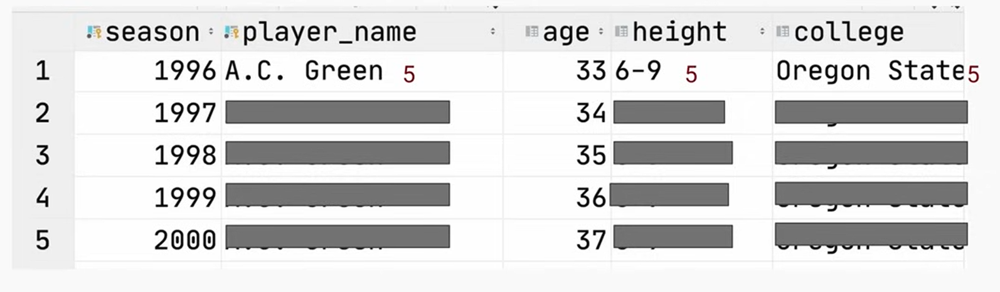

# LECTURE DAY 1
# Dimension Data Modeling 
## Dimensions
### Are attributes of a entity 
    - some of these dimensions may identify an entity
    - others just attributes
### Dimension come in two flavors
    - slowly changing
    - fixed
### Knowing your data consumer
    - Data analyst / Data scientists 
        -  Sould be very easy to query. nNot many complex data types.
    - Other data engineers 
        - Sould be compact and probably arder to query. Nested types are okay
    - ML models
        - depends on the model and how its trained
    - Customers
        - should be a very easy to interpret chart
### OLPT vs master data vs OLAP
    - OLPT (Online transactions processing)
        -  OPtimizes for low-latency
        (one user one entity)
    - OLAP (Online analytical Processing)
        - Optimizes for large volumen, group by queries, minimized JOINs
    - Master Data
        - Optimizes for completenses of entity definitions, dedupled.
### Mismatch needs= less business value.
    - Some biggest problems in data engineering occur when data is modeled for the wrong consumer!
    - be sore the customer are a valuable user and undestand all steps.
### OLPT and OLAP is a Continuum
    Production database snapshots => Master Data => OLAP Cubes => Metrics
### Cumulative table desing
     - core components
        - 2 dataframes (yesterday and today)
        - FULL OUTER JOIN the two data frames together
        - COALESCE values to keep everything around
        - Hang onto all history.
    - Usages
        - Growth analytical at Facebook (dim_all_users)
        - State transition tracking (we will cover this more analytics track, applying analytical patterns later)
 ### Comulative table desing (cont)
     - Strengths
        - Historical analysis without shuffle (A shuffle occurs when a distributed engine (e.g., Spark, Flink, Hive, Synapse, BigQuery) must move data across the network to satisfy an operation that requires data with the same key to be colocated.)
        - Easy "transition" analysis
    - Drawbacks
        - Can be backfilled sequenrially.
        - Handling PII data can be a mess since delete/inactive users get carried forward
### The compactness vs usability tradeoff
     - The most usable tables usually
        - Have no complex data 
        - Easily can be manipulated with WHERE and GROUP BY.
    - The most compact tables (no human readable)
        - Are compressed to be as small as possible and can't be queried directly until they're decoded.
    - The middle-ground tables.
        - use complex data types (e.g. ARRAY,MAP and STRUCT), making querying trickier but also compacting more.
    - When would you use eac type of table?
        - More compact
            - Online systems where latency and data volumes matter a lot. Consumers usually highly technical.
        - Middle-ground 
            - upstream staging/master data the majority of consumers are other data engineers
        - More usable 
            - When analytics is the main consumer and the majority of consumers are less technical.
### Struct vs Array vs Map

    - Struct
        - Key are rigidly defined compresion is good!
        - Values can be any type
    - Map
        - Keys are loosely defined, compresion is okay!
        - Values all have to be the same type
    - Array 
        - Ordinal
        - List of values that all have to be dame type.
### Termporal cardinality explosions of dimension
    - When you add a temporal aspect to your dimension and the cardinality increases by a least 1 order of magnitude
        - example:
            Airbnb has ~ 6 millions listings
                If we want to know the nightly pricing and available of each night for the next year 
                    that's 365*6 millions or about ~ 2 billions nights
                Should this data be:
                    Linting-level an array of nights?
                    listing night level with 2 billion rows?
                If you do the sorting, parquet will keep these two about same  size
### Badness of denormalized temporal dimensions
    - If you explode it out and need to join other dimension, Spark shuffle will ruin your compresion!
### Run length encoding compresion
    - Probably the most important compresion technique in big data right now. It's why parquet file format has become so sucessful.
    - Suffle can ruin this. (Be careful) Suffle happens in distributed enviroments when you do a JOIN and GROUP BY.

After a join , Spark may mix up ordening of the rows and ruin your compression.

# Personal notes:
## What is the purpose of the cumulative table design in data modeling?

### Primary Purpose
The purpose of cumulative table design is to **preserve the complete historical evolution of an entity** while enabling **efficient lifecycle and transition analysis** without repeatedly recomputing historical data.

---

### How a Cumulative Table Works
A cumulative table is updated incrementally by merging past and current states:

- Take the snapshot from **yesterday**
- Take the snapshot from **today**
- Perform a `FULL OUTER JOIN` on the entity key
- Use `COALESCE` to retain all known attribute values
- Never delete historical information

This produces a single, entity-centric view of history.

---

### Problems It Solves

- Avoids repeatedly scanning large event tables
- Enables efficient historical and longitudinal analysis
- Makes state transitions explicit
- Reduces expensive joins and aggregations at query time

---

### Typical Use Cases

- User lifecycle tracking (signup, activation, churn)
- Growth analytics
- Subscription or contract state evolution
- Customer journey analysis

---

### Benefits in Distributed Systems

- Minimizes Spark shuffles during analytical queries
- Improves query performance on large datasets
- Preserves compression efficiency (e.g., Parquet RLE)
- Shifts computation from query time to ingestion time

---

### Tradeoffs and Limitations

- Backfills must be performed sequentially
- Late-arriving data is harder to integrate
- Handling PII is complex due to persistent history
- Table width grows as history accumulates

---

### When to Use a Cumulative Table

Use cumulative table design when:
- Entity-level history is required
- Lifecycle and transition metrics are critical
- Read performance is more important than write simplicity

Avoid cumulative tables when:
- Only the current state is needed
- Frequent event-level reprocessing is required
- Regulatory deletion requirements dominate the design

---

### One-Sentence Summary
Cumulative table design stores the full historical state of an entity in an incrementally updated structure, enabling efficient lifecycle analysis while reducing recomputation and shuffles in distributed systems.

## In the context of dimensional data modeling, who benefits most from an OLAP cube?
OLAP cubes most benefit **business users and data analysts** who need fast, intuitive, and highly aggregated access to data for reporting and decision-making.

## What is a potential drawback of cumulative table design?

### Key Drawback
A major drawback of cumulative table design is that **it is difficult to backfill and correct historical data**, because updates must be applied **sequentially over time** rather than recomputed in parallel.

---

### Why This Is a Problem
Cumulative tables:
- Build history incrementally
- Depend on the previous state to compute the next state
- Cannot easily recompute past states without reprocessing all subsequent periods

This makes:
- Late-arriving data hard to integrate
- Historical corrections operationally expensive

---

### Additional Drawbacks

- Table width grows over time as more historical attributes accumulate
- Handling PII is complex because deleted or inactive entities persist historically
- Increased maintenance complexity compared to event-based models

### Explanation
Cumulative table design depends on the **previous day’s (or previous snapshot’s) state** to compute the current state.  
Because of this dependency:

- Backfills must be performed **sequentially**
- Historical corrections are operationally complex
- Parallel recomputation of history is difficult
---

### One-Sentence Summary
A key drawback of cumulative table design is the difficulty of backfilling and correcting historical data, since changes must be applied sequentially across the entire history.

# Day 1  lab 
    git clone git@github.com:DataExpert-io/data-engineer-handbook.git
    cd data-engineer-handbook/bootcamp/materials/1-dimensional-data-modeling

-- Postgres SQL code

select * from player_seasons limit 10;

/*SELECT
	*
FROM
	PUBLIC.PLAYER_SEASONS;

*/

SELECT typname
FROM pg_type
WHERE typname = 'season_stats';
DROP TYPE IF EXISTS season_stats CASCADE;
CREATE TYPE season_stats AS (
    season INTEGER,
    gp     INTEGER,
    pts    REAL,
    reb    REAL,
    ast    REAL
);
 drop TABLE players
 CREATE TABLE players (
     player_name TEXT,
     height TEXT,
     college TEXT,
     country TEXT,
     draft_year TEXT,
     draft_round TEXT,
     draft_number TEXT,
     season_stats season_stats[],
     current_season INTEGER,
     PRIMARY KEY (player_name, current_season)
 );

select * from players where current_season=2001
and player_name='Michael Jordan'

select * from player_seasons;

INSERT INTO players
with yesterday as (
select * from players
where current_season=2000
),
today as (

select * from player_seasons
where season=2001
)

select 
    COALESCE(t.player_name, y.player_name) AS player_name,
    COALESCE(t.height, y.height)           AS height,
    COALESCE(t.college, y.college)         AS college,
    COALESCE(t.country, y.country)         AS country,
    COALESCE(t.draft_year, y.draft_year)   AS draft_year,
    COALESCE(t.draft_round, y.draft_round) AS draft_round,
    COALESCE(t.draft_number, y.draft_number) AS draft_number,
CASE WHEN y.season_stats IS NULL
	THEN ARRAY[
	ROW(
	t.season,
	t.gp,
	t.pts,
	t.reb,
	t.ast)::season_stats]
WHEN t.season IS NOT NULL THEN y.season_stats ||ARRAY[ROW(
t.season,
t.gp,
t.pts,
t.reb,
t.ast)::season_stats]
ELSE y.season_stats
END
AS season_stats,
COALESCE(t.season,y.current_season +1) AS current_season
from today t full outer join yesterday y
on t.player_name=y.player_name;

select player_name,
UNNEST(season_stats)::season_stats AS season_stats
from players where current_season=2001
and player_name='Michael Jordan'

with unested as 
(select player_name,
UNNEST(season_stats)::season_stats AS season_stats
from players where current_season=2001
)
/*and player_name='Michael Jordan')*/
select player_name,(season_stats::season_stats).*
from unested

CREATE TYPE scoring_class AS ENUM('star','good','average','bad');

 drop TABLE players;
 CREATE TABLE players (
     player_name TEXT,
     height TEXT,
     college TEXT,
     country TEXT,
     draft_year TEXT,
     draft_round TEXT,
     draft_number TEXT,
     season_stats season_stats[],
	 scoring_class scoring_class,
	 years_since_last_season INTEGER,
     current_season INTEGER,
     PRIMARY KEY (player_name, current_season)
 );

INSERT INTO players
with yesterday as (
select * from players
where current_season=2003
),
today as (

select * from player_seasons
where season=2004
)

select 
    COALESCE(t.player_name, y.player_name) AS player_name,
    COALESCE(t.height, y.height)           AS height,
    COALESCE(t.college, y.college)         AS college,
    COALESCE(t.country, y.country)         AS country,
    COALESCE(t.draft_year, y.draft_year)   AS draft_year,
    COALESCE(t.draft_round, y.draft_round) AS draft_round,
    COALESCE(t.draft_number, y.draft_number) AS draft_number,
CASE WHEN y.season_stats IS NULL
	THEN ARRAY[
	ROW(
	t.season,
	t.gp,
	t.pts,
	t.reb,
	t.ast)::season_stats]
WHEN t.season IS NOT NULL THEN y.season_stats ||ARRAY[ROW(
t.season,
t.gp,
t.pts,
t.reb,
t.ast)::season_stats]
ELSE y.season_stats
END
AS season_stats,

CASE WHEN t.season IS NOT NULL THEN 
	CASE WHEN t.pts>20 THEN 'star'
		 WHEN t.pts>15 THEN 'good'
		 WHEN t.pts>10 THEN 'average'
		 ELSE 'bad'
	END:: scoring_class
ELSE y.scoring_class
END AS scoring_class,
CASE WHEN t.season IS NOT NULL THEN 0
ELSE y.years_since_last_season+1
END as years_since_last_season,
COALESCE(t.season,y.current_season +1) AS current_season

from today t full outer join yesterday y
on t.player_name=y.player_name;

select * from players
where current_season=2003

select player_name,

(season_stats[CARDINALITY(season_stats)]::season_stats).pts/
CASE WHEN(season_stats[1]::season_stats).pts=0 THEN 1 ELSE (season_stats[1]::season_stats).pts
END AS season_avg
from players
where current_season=2001
and scoring_class='average'

order by 2 desc

# Day 2 Lecture
## Slowly changing dimensions (SCD)
## Idempotent pipelines are critical
    Your pipeline produces the same result regardless of when it's ran!!! 
    what does idempotent mean?
        - Running the same operation multiple times has the same effect as running it once.
        - denoting an element of a set which is unchanged in value when multiplied or otherwise operated ob by ifself.
## pipelines should produce the same results
    - regardless of when they are run
    - regardless of how many times they are run
    - regardless of the order in which they are run
## Why  is the troubleshooting non-idempotent pipelines so hard?
    - silent failure!
    - you only see it when you get data inconsistencies and data analyst tell at you. 
## What can make a pipeline non-idempotent?
    - INSERT INTO without TRUNCATE
        - Use MERGE or INSERT OVERWRITE every time please
        - Using Start_date> Without a corresponding end_date<
        - Not using a full set of partition sensors
            -pipeline might run when there is no/partial data
        - Not using depends_on_past for comulative pipelines
        - relying on the "latest" partition not proprerly modeled SCD table
            - Comulative tables design AMPLIES this problem!
        - Relying on the "latest" partition of anything else that is not properly modeled for it.
            - e.g event tables with late arriving data

## The pains of not having idempotent pipelines
    - backfills cause inconsistencies between the old and restated data 
    - very hard to troubleshoot
    - Unit testing cann't replicate the production behavior
    - Silent failures
## Should you model as slowly changing dimension (SCD)?
    -Max, the creator of Airflow HATES SCD data modeling
    -Link to Max’s article about why SCD’s SUCK
            [text](https://maximebeauchemin.medium.com/functional-data-engineering-a-modern-paradigm-for-batch-data-processing-2327ec32c42a)
    -What are the options here?
        -Latest snapshot
        -Daily/Monthly/Yearly snapshot
        -SCD (dimensions that change over time)
    -How slowly changing are the dimensions you’re modeling?
## Why do dimensions change?
    -Someone decides they hate iPhone and want Android now
    -Someone migrates from team dog to team cat
    -Someone migrates from USA to another country
## How can you model dimensions that change?
    - Singular snapshots
    -BE CAREFUL SINCE THESE ARE NOT IDEMPOTENT
    -Daily partitioned snapshots
    -SCD Types 1,2,3
## The types of Slowly Changing Dimensions
    -Type 0
        -Aren’t actually slowly changing (e.g. birth date)
    -Type 1
        -You only care about the latest value
        -NEVER USE THIS TYPE BECAUSE IT MAKES YOUR PIPELINES NOT IDEMPOTENT ANYMORE
    Type 2
        -You care about what the value was from “start_date” to “end_date”
            -Current values usually have either an end_date that is:
            - NULL 
            -Far into the future like 9999-12-31
        -Hard to use:
            -Since there’s more than 1 row per dimension, you need to be careful about filtering on time
        -MY FAVORITE TYPE OF SCD
            -The only type of SCD that is purely IDEMPOTENT
    Type 3-You only care about “original” and “current”
    -Benefits
        -You only have 1 row per dimension
    -Drawbacks
        -You lose the history in between original and current
    -Is this idempotent?
        -Partially, which means it’s not
## Which types are idempotent?
Type 0 and Type 2 are idempotent
        -Type 0 is because the values are unchanging
        -Type 2 is but you need to be careful with how you use the start_date and end_date syntax!
    -Type 1 isn’t idempotent 
        -If you backfill with this dataset, you’ll get the dimension as it is now, not as it was then!
    -Type 3 isn’t idempotent
        -If you backfill with this dataset, it’s impossible to know when to pick “original” vs “current” 
        and you’ll either 
## SCD2 Loading
    -Load the entire history in one query
        -Inefficient but nimble
        -1 query and you’re done
    -Incrementally load the data after the previous SCD is generated
        -Has the same “depends_on_past” constraint
        -Efficient but cumbersome

# Day 2 Lab

/*
 drop TABLE players;
 CREATE TABLE players (
     player_name TEXT,
     height TEXT,
     college TEXT,
     country TEXT,
     draft_year TEXT,
     draft_round TEXT,
     draft_number TEXT,
     season_stats season_stats[],
	 scoring_class scoring_class,
	 years_since_last_season INTEGER,
	 is_active BOOLEAN,
     current_season INTEGER,
     PRIMARY KEY (player_name, current_season)
 );

INSERT INTO players

WITH years AS (
    SELECT *
    FROM GENERATE_SERIES(1996, 2022) AS season
), p AS (
    SELECT
        player_name,
        MIN(season) AS first_season
    FROM player_seasons
    GROUP BY player_name
), players_and_seasons AS (
    SELECT *
    FROM p
    JOIN years y
        ON p.first_season <= y.season
), windowed AS (
    SELECT
        pas.player_name,
        pas.season,
        ARRAY_REMOVE(
            ARRAY_AGG(
                CASE
                    WHEN ps.season IS NOT NULL
                        THEN ROW(
                            ps.season,
                            ps.gp,
                            ps.pts,
                            ps.reb,
                            ps.ast
                        )::season_stats
                END)
            OVER (PARTITION BY pas.player_name ORDER BY COALESCE(pas.season, ps.season)),
            NULL
        ) AS seasons
    FROM players_and_seasons pas
    LEFT JOIN player_seasons ps
        ON pas.player_name = ps.player_name
        AND pas.season = ps.season
    ORDER BY pas.player_name, pas.season
), static AS (
    SELECT
        player_name,
        MAX(height) AS height,
        MAX(college) AS college,
        MAX(country) AS country,
        MAX(draft_year) AS draft_year,
        MAX(draft_round) AS draft_round,
        MAX(draft_number) AS draft_number
    FROM player_seasons
    GROUP BY player_name
)
SELECT
    w.player_name,
    s.height,
    s.college,
    s.country,
    s.draft_year,
    s.draft_round,
    s.draft_number,
    seasons AS season_stats,
    CASE
        WHEN (seasons[CARDINALITY(seasons)]::season_stats).pts > 20 THEN 'star'
        WHEN (seasons[CARDINALITY(seasons)]::season_stats).pts > 15 THEN 'good'
        WHEN (seasons[CARDINALITY(seasons)]::season_stats).pts > 10 THEN 'average'
        ELSE 'bad'
    END::scoring_class AS scoring_class,
    w.season - (seasons[CARDINALITY(seasons)]::season_stats).season as years_since_last_active,
    (seasons[CARDINALITY(seasons)]::season_stats).season = season AS is_active,
    w.season
FROM windowed w
JOIN static s
    ON w.player_name = s.player_name;
*/
/*

DROP TABLE players_scd;
CREATE TABLE players_scd
(
player_name TEXT,
scoring_class scoring_class,
is_active BOOLEAN,
start_season INTEGER,
end_season INTEGER,
current_season INTEGER,
PRIMARY KEY(player_name,start_season)
);

INSERT INTO players_scd
WITH with_previous AS (
SELECT 
	player_name,
	current_season,
	scoring_class,
	is_active,
	LAG(scoring_class,1) OVER(PARTITION BY player_name ORDER BY current_season) AS previous_scoring_class,
	LAG(is_active,1) OVER(PARTITION BY player_name ORDER BY current_season) AS previous_is_active
	FROM players
	WHERE current_season <=2021
), with_indicators AS (

SELECT *,
	CASE 
		WHEN scoring_class<>previous_scoring_class THEN 1
		WHEN is_active<>previous_is_active THEN 1
		ELSE 0
	END AS change_indicator
FROM with_previous
), with_streaks AS (
SELECT *,SUM(change_indicator) OVER (PARTITION BY player_name ORDER BY current_season) AS streak_identifier
FROM with_indicators
)
SELECT
	player_name,
	--streak_identifier,
	scoring_class,
	is_active,
	MAX(current_season) AS start_season,
	MIN(current_season) AS end_season,
	2021 AS current_season
FROM 
with_streaks
GROUP BY 
player_name,
streak_identifier,
is_active,
scoring_class
ORDER BY player_name,streak_identifier

SELECT * FROM players_scd

*/

DROP TABLE players_scd;
CREATE TABLE players_scd
(
player_name TEXT,
scoring_class scoring_class,
is_active BOOLEAN,
start_season INTEGER,
end_season INTEGER,
current_season INTEGER,
PRIMARY KEY(player_name,start_season)
);

INSERT INTO players_scd

WITH with_previous AS (
SELECT 
	player_name,
	current_season,
	scoring_class,
	is_active,
	LAG(scoring_class,1) OVER(PARTITION BY player_name ORDER BY current_season) AS previous_scoring_class,
	LAG(is_active,1) OVER(PARTITION BY player_name ORDER BY current_season) AS previous_is_active
	FROM players
	WHERE current_season <= 2021
), with_indicators AS (

SELECT *,
	CASE 
		WHEN scoring_class<>previous_scoring_class THEN 1
		WHEN is_active<>previous_is_active THEN 1
		ELSE 0
	END AS change_indicator
FROM with_previous
), with_streaks AS (
SELECT *,SUM(change_indicator) OVER (PARTITION BY player_name ORDER BY current_season) AS streak_identifier
FROM with_indicators
)
SELECT
	player_name,
	scoring_class,
	is_active,
	MIN(current_season) AS start_season,
	MAX(current_season) AS end_season,
	2021 AS current_season
FROM 
with_streaks
GROUP BY 
player_name,
streak_identifier,
is_active,
scoring_class
ORDER BY player_name,streak_identifier

/*CREATE TYPE scd_type AS (
			scoring_class scoring_class,
			is_active boolean,
			start_season int,
			end_season int
)
*/

WITH
	last_season_scd AS(
		SELECT 
		player_name,
		scoring_class,
		is_active,
		start_season,
		end_season
		FROM players_scd
		WHERE current_season=2021
		AND end_season=2021
		), 
	historical_scd AS(
		SELECT 	
		player_name,
		scoring_class,
		is_active,
		start_season,
		end_season
		FROM players_scd
		WHERE current_season=2021
		AND end_season<2021
	),
	this_season_data AS(
		SELECT * FROM players
		WHERE current_season=2022
		),
	unchanged_records AS (
		   SELECT
                ts.player_name,
                ts.scoring_class,
                ts.is_active,
                ls.start_season,
                ts.current_season as end_season
        FROM this_season_data ts
        JOIN last_season_scd ls
        ON ls.player_name = ts.player_name
         WHERE ts.scoring_class = ls.scoring_class
         AND ts.is_active = ls.is_active
		),
	changed_records AS (
		SELECT 
		ts.player_name,
		ts.scoring_class,
		ts.is_active,
		ls.start_season,
		ls.end_season,
		UNNEST(ARRAY[ ROW(
				ls.scoring_class,
				ls.is_active,
				ls.start_season,
				ls.end_season
		)::scd_type,
		ROW(
				ts.scoring_class,
				ts.is_active,
				ts.current_season,
				ts.current_season
		)::scd_type
		]) as records
		FROM this_season_data  AS ts
			 JOIN last_season_scd  AS ls
			ON ls.player_name=ts.player_name
			WHERE ts.scoring_class=ls.scoring_class AND
				  ts.is_active=ls.is_active
	), new_record AS(
		SELECT
		ts.player_name,
		ts.scoring_class,
		ts.is_active,
		ts.current_season AS start_season,
		ts.current_season AS end_season

		FROM this_season_data AS ts
		LEFT JOIN last_season_scd ls 
		ON ts.player_name=ls.player_name
		where ls.player_name IS NULL

	),
unnested_changed_records AS (
			SELECT player_name,
				(records::scd_type).scoring_class,
				(records::scd_type).is_active,
				(records::scd_type).start_season,
				(records::scd_type).end_season
			FROM changed_records
	)
SELECT * FROM historical_scd
UNION ALL
SELECT * FROM unchanged_records
UNION ALL
SELECT * FROM unnested_changed_records
UNION ALL
SELECT * FROM new_record

	
	/*
	,
	new_and_changed_records AS(
		SELECT 
		ts.player_name,
		ts.scoring_class,
		ts.is_active,
		ls.start_season,
		ls.current_season as end_season
		FROM this_season_data  AS ts
			LEFT JOIN last_season_scd  AS ls
			ON ls.player_name=ts.player_name
			WHERE (
			ts.scoring_class<>ls.scoring_class 
			OR
			ts.is_active<>ls.is_active
				  ) 
	)
	*/
